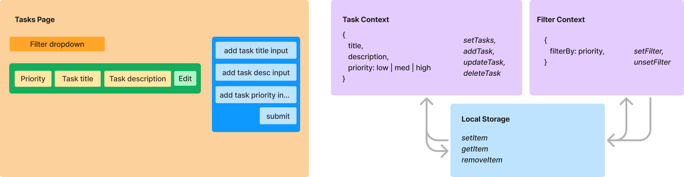

# Task Tracker

## Scripts

- Run: npm run start
- Test: npm run test

## Overview

I managed to get through a bunch of the tasks over a broken period from Monday — Tuesday (whilst children are at school!)
I haven't been able to approach editing tasks, but I've documented how — and provided the state mechanism for doing so.
I have put together some examples of test coverage, but this is by no means complete.
The UI is _very_ basic and I have not prioritised it for this task.

## Requirements

- Display list of tasks
- Allow tasks to be added, edited and deleted
- Filter tasks by priority using dropdown
- Persist and read using localStorage

## System Design

